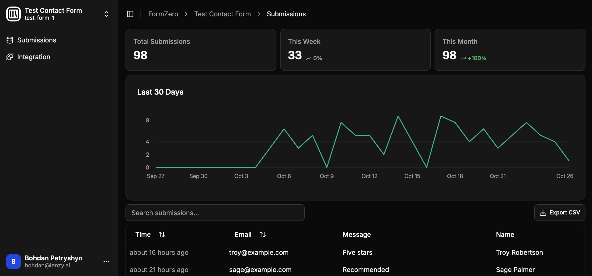

<h1 align="center">FormZero</h1>

  A forever free, open-source form backend for static sites you can self-host on Cloudflare in one click
   
   
  🔓 <em>No paid features.</em> 📀 <em>Own your data.</em> ⚡️ <em>Start in 3 minutes</em>

 

Perfect for <em>contact forms</em>, <em>waitlists</em>, <em>surveys</em>, <em>newsletter signups</em>, and more.

 

## Why FormZero?

- **Save time** - Form backends are simple software; don't waste time building one for your static site
- **No artificial limits** - Commercial services often restrict you to ~50 submissions/month with no data export
- **Deploy in minutes** - As easy as signing up for a commercial service. Not a single line of code, not even YAML

Use [FormZero](https://github.com/BohdanPetryshyn/formzero) for your next big thing! ⭐ Give it a star to not forget.

 

## Features

- **Submit HTML Forms** - Add FormZero's endpoint to your form's `action` attribute
- **Submit JSON Data** - Send payloads via `fetch` or `XMLHttpRequest`
- **Unlimited Forms** - Create as many as you need
- **Unlimited Submissions** - Receive thousands per hour
- **Analytics Dashboard** - View submission trends and stats
- **Export CSV** - Download all submissions in one click
- **Spam Protection** - Proof of Work CAPTCHA and honeypot fields (coming soon)
- **Email Notifications** - Add your [Resend](http://resend.com) API key to receive notifications (coming soon)

 

## Deploy in Seconds ⚡

Deploy your own serverless form backend in seconds - as easy as signing up for a commercial service:

1. Click the ***Deploy to Cloudflare*** button above
2. Log in to your ***free*** Cloudflare account or create one (***no credit card required***)
3. Follow the prompts - your instance will be running in ***3 minutes***

Everything fits within ***Cloudflare's free tier*** - receive up to ***100,000 submissions/day*** and store up to ***4,000,000 submissions*** for free. Upgrade later for just $5 if needed.

 

### How Deploy to Cloudflare Works

Here's what happens when you click the button:

1. Cloudflare creates a copy of this repository in your GitHub or GitLab account
2. You provide configuration options:
   - **Project name** (e.g. "formzero")
   - **Database name** (e.g. "formzero")
   - **Auth secret** (use [jwtsecrets.com](https://jwtsecrets.com) or `openssl rand -hex 16` to generate one)
3. Cloudflare builds and deploys FormZero to your account
4. You get a unique URL (e.g. `https://formzero.your-domain.workers.dev`) to access your dashboard

Read the [Cloudflare documentation](https://developers.cloudflare.com/workers/platform/deploy-buttons/) for more details.

 

## Tech Stack 🛠️

- **[Cloudflare Workers](https://workers.cloudflare.com/)** + **[D1](https://developers.cloudflare.com/d1/)**
- **[React Router v7](https://reactrouter.com/)**
- **[Tailwind CSS](https://tailwindcss.com/)** + **[shadcn/ui](https://ui.shadcn.com/)**

 

## Contributing 🤝

Contributions are welcome - add features you need or fix bugs by opening an issue or submitting a pull request.

 

## License

MIT

